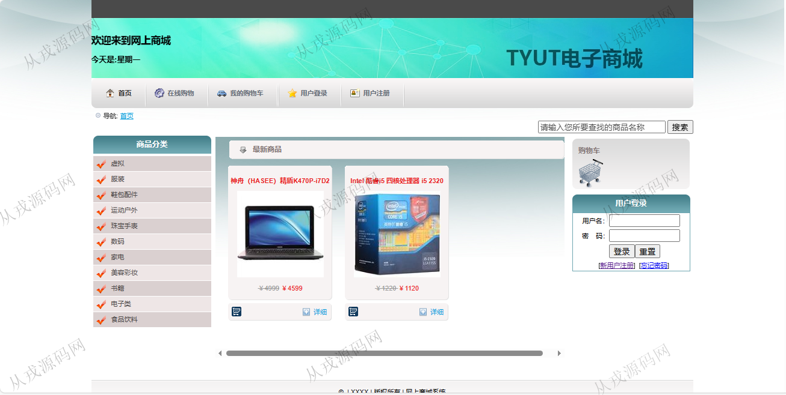
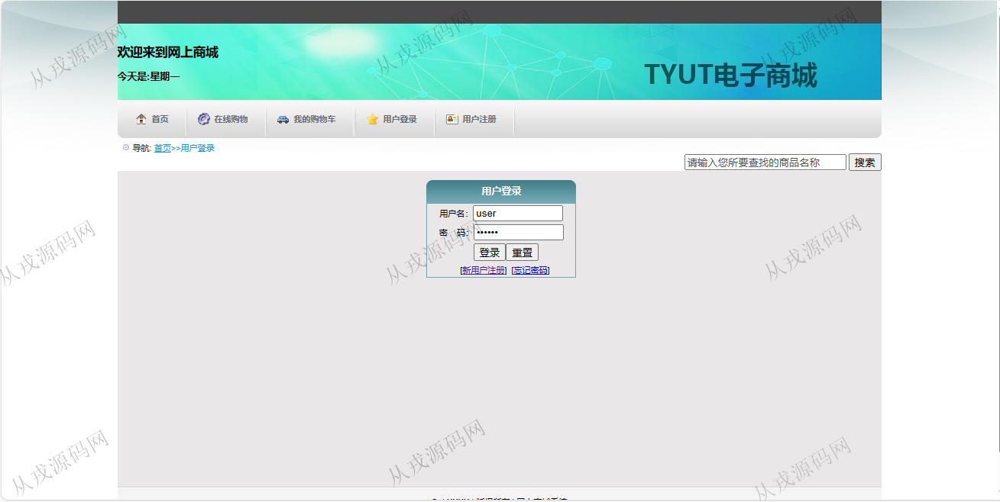
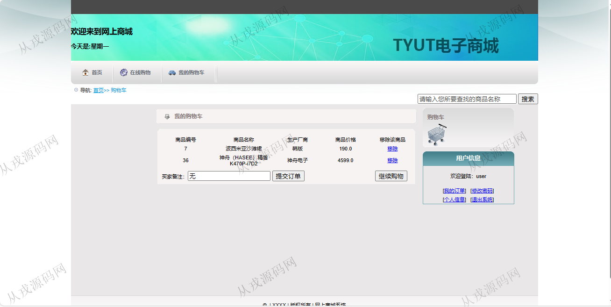
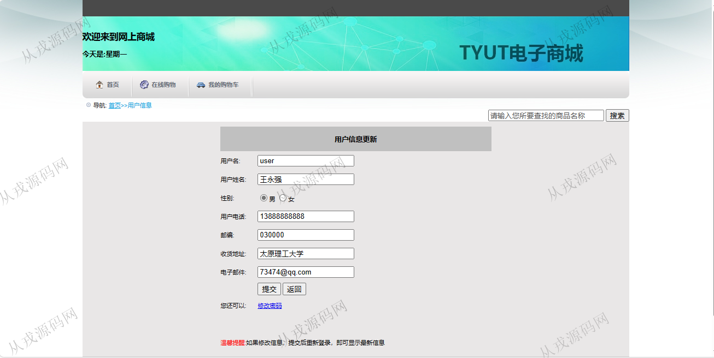
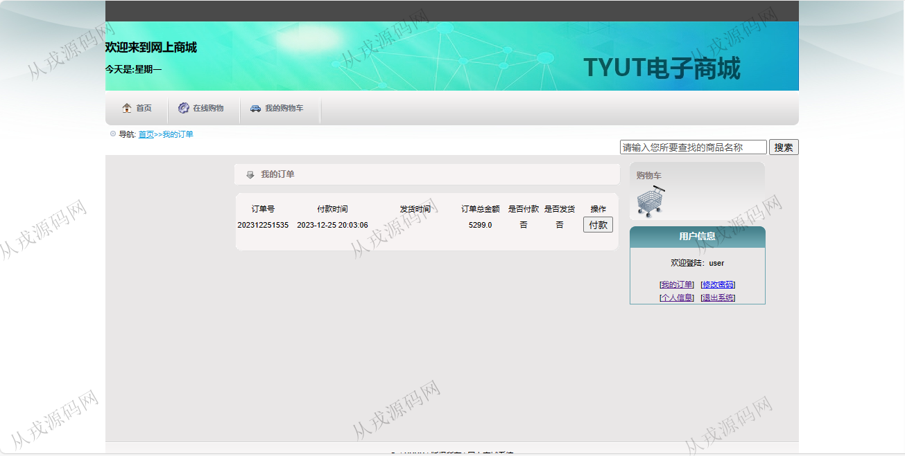
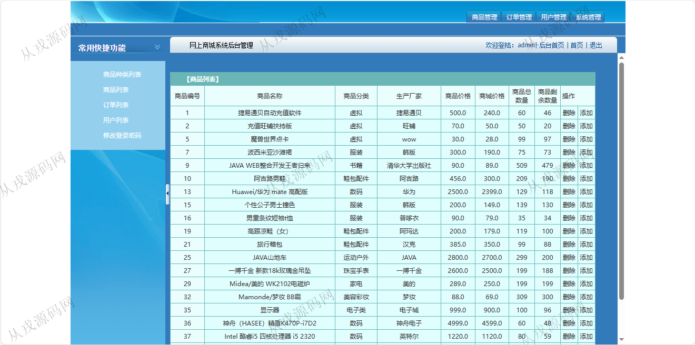
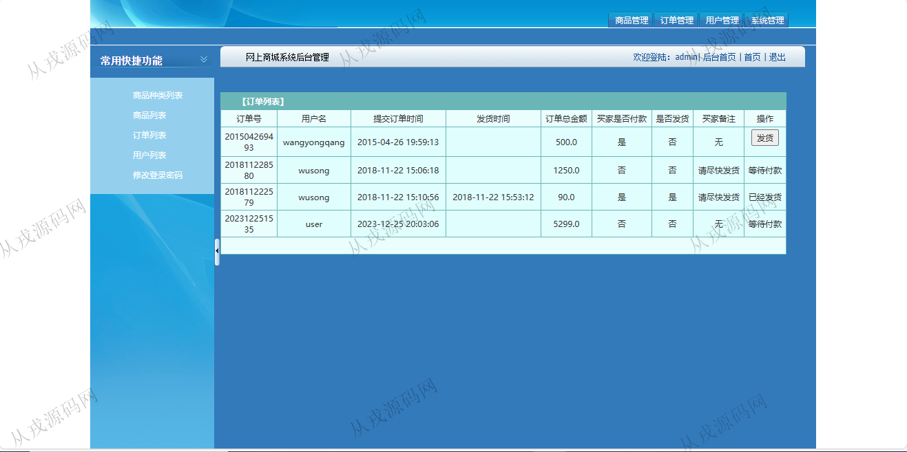

<h1 align="center">74.网上电子商城管理系统</h1>

 获取sql文件 QQ: 386869957 QQ群: 377586148 

 [推荐站点: 从戎源码网](https://armycodes.com/) 

## 简介

> 本代码来源于网络,仅供学习参考使用!
>
> 提供1.远程部署/2.修改代码/3.设计文档指导/4.框架代码讲解等服务
> 
> 用户端登录地址：http://localhost:8080/login.jsp
> 
> user 123456
> 
> 管理端登录地址：http://localhost:8080/admin/login.jsp
> 
> admin 123456
>

## 项目介绍
基于ssh的网上电子商城管理系统：前端jsp、js，后端 struts、spring、hibernate，集成商品浏览，商品详情，购物车，在线提交订单，后台发布商品，商品类型管理等功能于一体的系统。

## 功能介绍

### 管理员

- 商品分类管理：商品分类信息的增删改查
- 商品管理：商品信息的增删改查，商品图片上传
- 订单信息：订单列表，订单发货
- 用户管理：用户信息的增删改查，用户关键词查询

### 用户

- 基本功能：登录、注册、修改密码，个人信息查询和修改
- 首页：商品分类列表，最新商品列表，商品搜索
- 在线购物：商品详情，加入购物车，我的购物车列表，提交订单

## 环境

- <b>IntelliJ IDEA 2009.3</b>

- <b>Mysql 5.7.26</b>

- <b>Tomcat 7.0.73</b>

- <b>JDK 1.8</b>

## 运行截图

